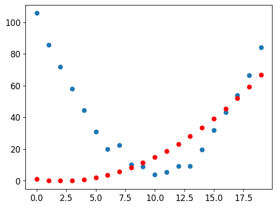
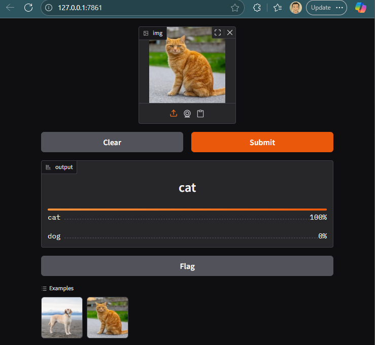

# Notes from the FastAI course

This project is built along taking the [FastAI Course](https://course.fast.ai/). Based on prior experience, using websearch may be problematic on Kaggle, Colab and similar.

## Chapters

### 1.3 Neural Networks from Scratch - Stochastic Gradient Descent
[Jupyter](1.3/SGD.ipynb)

1. Went through building a linear model from scratch, using pure PyTorch tensors and operations. The model was fitting a quadratic function on generated data.
1. Built a 95% accurate model differentiating between 3s and 7s from MNIST dataset.
1. Coded raw PyTorch, then wrapped in fastai Learners, one with Linear model, one with simple neural network (1 hidden layer of 30 neurons with ReLU).

### 1.2 Deploying
[Jupyter](1.2/dogs_cats.ipynb)

1. Using Python's pickle serialization to export/load models - simplistic. PKL isn't interoperable with other programming languages, and serialized objects will fail to deserialize on changed code.
1. Using Gradio to create dead-simple UX for the loaded model and running predict() function.
1. Useful helper functions in the fastai library for viewing examples with largest loss function, and for cleaning dataset according to loss-function. Unusual technique to make dirty training on uncleaned data, and use the draft model to find dirty data.

### 1.1 Getting started - training visual classifier
[Jupyter](1.1/is-it-a-bird-creating-a-model-from-your-own-data.ipynb)

1. Installed CUDA-enabled PyTorch to use laptop GPU - https://pytorch.org/get-started/locally/
1. Issues with DuckDuckGo Search for images. Permanent 429s. Replaced with GoogleSearchAPI Custom Search opened in the Agents project. 100 searches per day for free.
1. Categorizing between forks and knifes. The model does well despite bogus images within training data.

