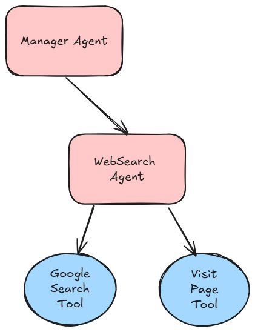

# hf-multiagent

A demonstration of multi-agent orchestration using [smolagents](https://github.com/smol-ai/smolagents), featuring collaborative agents for web search and reasoning.

The example is a simplistic research-agent including:
- A **WebAgent** that can search the web and visit webpages. CodeAgent (`Qwen/Qwen2.5-Coder-32B-Instruct`)
- A **ManagerAgent** that plans, delegates, and synthesizes results using advanced reasoning (`meta-llama/Llama-3.3-70B-Instruct`)



## Learning

I was testing the lesson assumption that this will only work with strong reasoning model (aka expensive model), and I quickly ran into issues: 
- when using smaller Instruct models (e.g. `mistralai/Mistral-Small-Instruct-2409`) the smolagent orchestration simply does not work out of the box. The issues felt less in model capability and more in `smolagents` framework glue to do the tool call preparation and parsing the results.
- some larger models, e.g. `mistralai/Mistral-Large-Instruct-2407`,  do not work with HF's `InferenceClientModel` abstraction to offer model calls on serverless API. The information about compatibility is not clear in HF portal. The runtime errors about it are very unclear as well.

The multi-agent delievered correct result in the checked-in configuration, however it took quite some time and ~ $0.30.


There seem to be quite a zoo of models available on HF, and the portal filters do not easily inform compatibility with their APIs. The tradeoff in simplicity offered by `smolagents` start hurting here, as the control over tool invocation is abstracted away. Next steps would require framework deep dive for extensibility points, or moving on to more advanced frameworks --> LangChain, LlamaIndex.

## Use

### Install dependencies:
```sh
pip install -r requirements.txt
```

### Configure environment variables
Create a `.env` file in the project root with your Hugging Face and SerpAPI tokens:
```
HF_TOKEN=your_hf_token_here
SERPAPI_API_KEY=your_serpapi_key_here
```

### Run

Run the multi-agent script:

```sh
python .\multi-agent.py -h
usage: multi-agent.py [-h] [--prompt PROMPT]

options:
  -h, --help       show this help message and exit
  --prompt PROMPT  Prompt for the manager agent


python multi-agent.py --prompt "What is the population of Helsinge, Denmark?"
```
